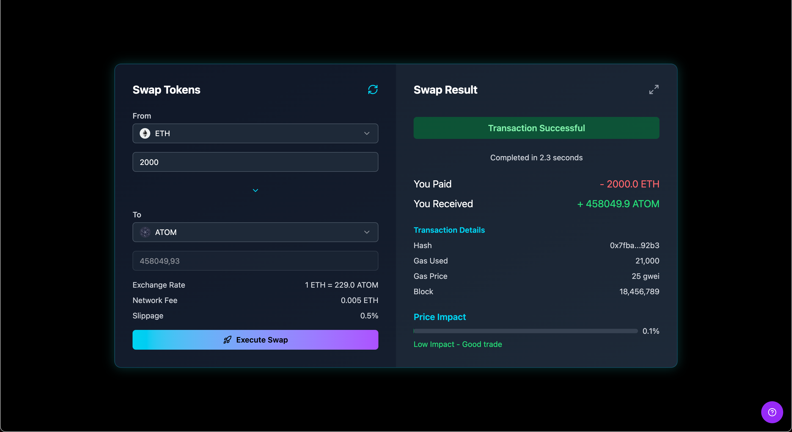

# 💱 Currency Swap Form – Submission Overview

## 🎯 Task Summary

Create a currency swap form to allow users to exchange assets from one currency to another.  
The solution focuses on:

- Intuitive UX & form validation
- Clean frontend code structure
- Visual feedback for user actions
- Bonus: Using Vite

> ✅ AI tools were allowed for mocking, UI, or design assistance

---

## 🛠 Features Implemented

- 🔁 Swap interface with **token selectors**, **amount inputs**, and **live exchange rate display**
- 💬 Real-time **input validation**
- ⏳ **Mocked backend delay** with loading indicator on submit
- 🧾 **Transaction summary panel** showing:
  - From/To amounts
  - Gas used
  - Transaction hash
  - Block number
- 🧮 **Price Impact calculation** with visual bar + status tag

---

## 🔗 Preview

[🎥 Watch Loom Walkthrough](https://www.loom.com/share/97f516f4e8bf42e981380e48d60b2e01)
